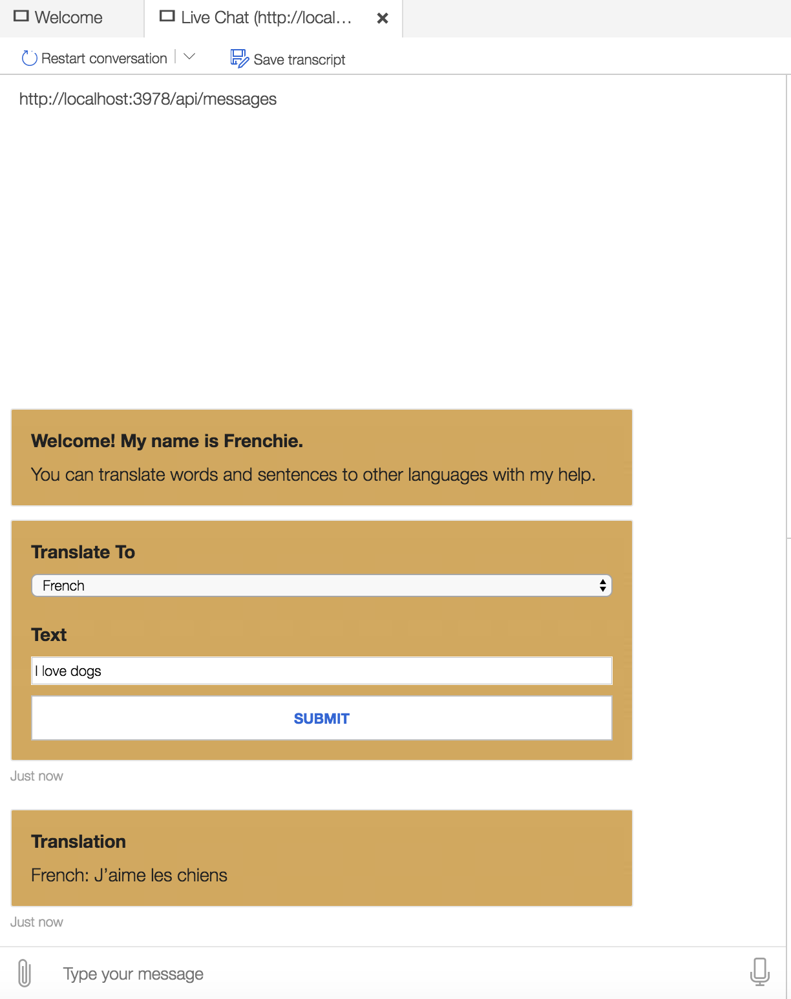
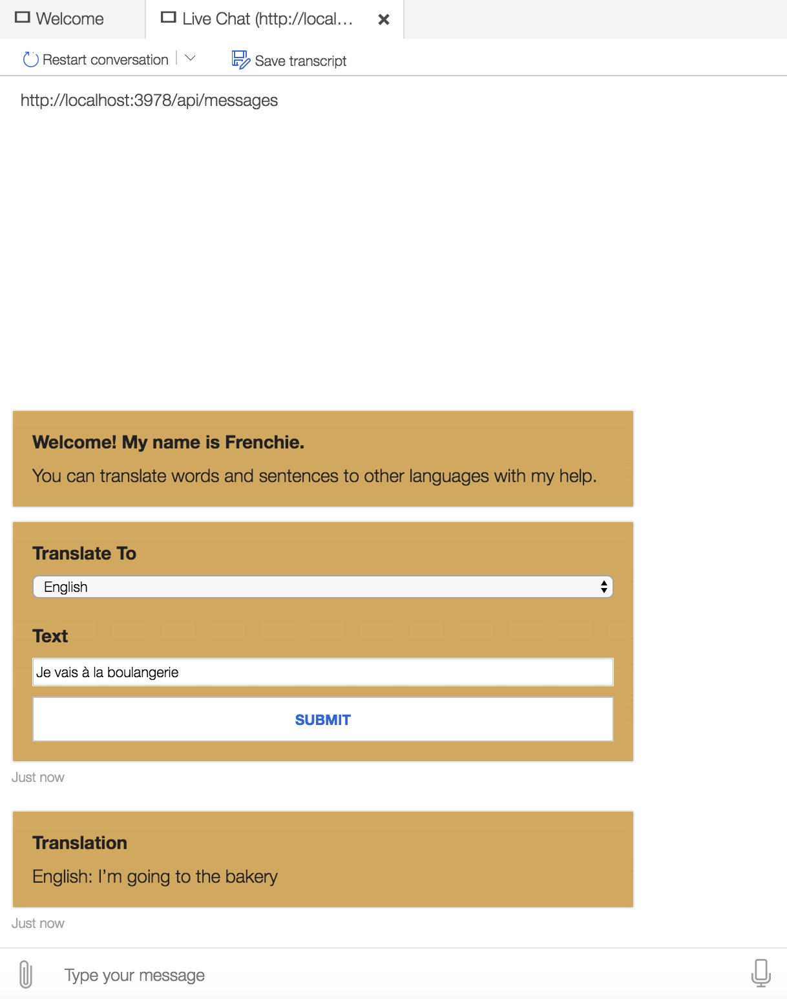

# Microsoft Translator Bot
Is a translator bot built with Microsoft Chat Bot and Microsoft Translate Cognitive Service.

## Prerequisites
- Node.js version 10.14 or higher
- Bot Framework Emulator V4

## To Test The Bot Locally
- Install modules
    ```bash
    yarn install
    ```
- Install modules
    ```bash
    yarn start
    ```
  or 
    ```bash
    yarn watch
    ```
- Launch Bot Framework Emulator
- File -> Open Bot
- Enter a Bot URL of `http://localhost:3978/api/messages`

## Samples
<p float="left">
  
   
</p>
